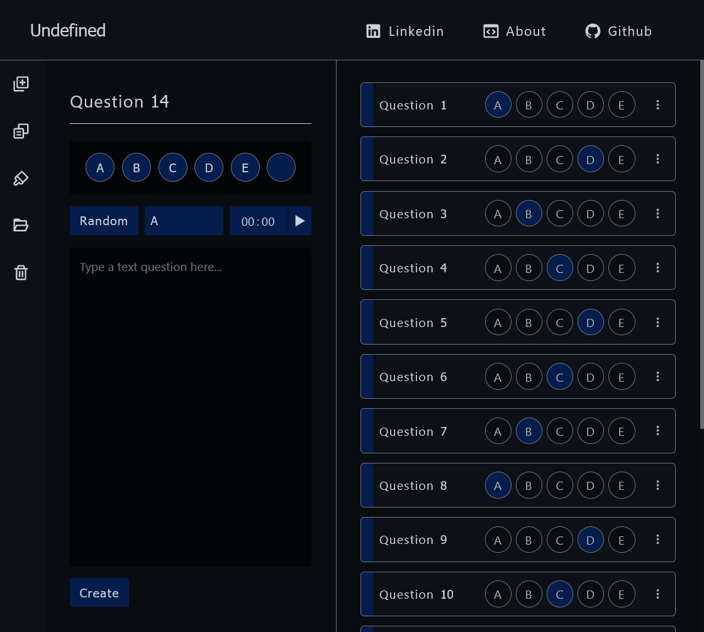

<br />

<h1 align="center">Question helper</h1>
<p align="center">Plataforma desenvolvida para salver o gabarito de provas e atividades durante o EAD. Tem como objetivo suprir as dificuldades das provas online, visto que, muitos plataformas não salvam os dados, dessa forma, em uma possível queda de energia ou eventual problema que exija um recarregamento da pagina, todos as respostas são perdidas. Ademais, a plataforma permite salvar os gabaritos em repositórios, permitindo a arquivação dos dados de forma mais organizada.</p>

<p align="center">
 <a href="#motivacao">Motivação</a> |
 <a href="#solucoes">Soluções</a> |
 <a href="#compatibilidade">Compatibilidade</a> |
 <a href="#estrutura">Estrutura</a> |
 <a href="#database">Database</a> |
 <a href="#storage">Storage</a>
 <a href="#futuro">Futuro</a>
</p>

<h4 align="center"> 
	🚧  Under construction...  🚧
</h4>


<div id="motivacao" />

## Motivação

Durante o EAD, a minha escola contratou uma plataforma para as aulas, contudo, as avaliações e atividades apresentavam alguns problemas. Primeiramente, o tempo de carregamento era relativamente elevado, em que, devido ao tempo restrito de avaliação, esse "delay" causou um pouco de frustração no meu caso, prejudicando diretamente a minha nota.

Ademais, as questões não eram salvas automaticamente, dessa forma, era necessário salvar cada questão antes de passar para a próxima questão. O problema é que, em muitos casos, eu esquecia de salvar. Consequentemente, eu preciso fazer a mesma questão várias vezes. Da mesma forma, as ocilações na internet impossibilitavam o carregamento da questão seguinte.

<div id="solucoes" />

## Suluções

A plataforma é uma solução mais prática e com um design melhor que um arquivo ".txt", dessa forma, eu utilizei a API do Browser IndexedDB como banco de dados e o React JS como Front-end. O Banco de dados é local, dessa forma é considerávelmente rápido e cada input é salvo em tempo real no localStorage.

Com o objetivo de aumentar a velocidade, cada questão é renderizada separadamente pelo react e adicionada pelo DOM. Uma outra alternativa seria utilizar o useState do React, porém, a cada questão adicionada, o React renderiza todas as questões, aumentando muito o tempo de carregamento em um grande número de questões.
Como a plataforma deveria funcionar offline, optei por utilizar a indexedDB, uma API para armazenamento client-side de quantidades significantes de informações e buscas com alta performance por índices.

Os inputs também são controlados pelo DOM, pois como os inputs são alterados pela Navbar, o componente pai mais próximo é o próprio app, dessa forma fica confiável acessar um useState de um componente tão distante.

<div id="compatibilidade" />

## Compatibilidade


A plataforma foi desenvolvida no FireFox, dessa forma, pode apresentar bugs e problemas em outros navegadores, principalmente o css. Apenas o Internet Explorer não apresenta compatibilidade com o indexedDB, impossibilitando o uso.
A versão mobile ainda está sendo desenvolvida

<span>  </span>
<span>  </span>

	
<div id="estrutura" />

# Estrutura

- __Components__: componentes renderizados pelo react
- __Data base__: inicia e conecta com a IndexedDB
- __Storage__: funções que conectam o DOM com a database
- __Global__: 
  - Design: Styled components global, tem como objetivo facilitar o design para diferentes plataformas como o media query, contudo, apenas os componentes mais recentes utilizam.
  - Components: São os componentes mais isolados que eu pretendo usar em projetos futuros, dessa forma, possuem uma documentação melhor.

<div id="database" />

## Database

Objeto **repository**: `{ id: Repository-(date)-(timestamp)-(random), name: ----, }`.
Além da indexedDB, o ID e o nome são salvos no localStorage com as chaves repositoryID, repository respectivamente.

Objeto **question**:
```
  question: {
    id: Question-(timestamp)-(random),
    value: ----,
    number: ---,
    attributes:
    {
      type: [ alternative, text ],
      marker: [ marker, correct, erro ],
      time: --:--,
    },
    repositoryID: Repository-(date)-(timestamp)-(random)
  }
```

### Módulos

`database` - Responsável por criar a estrutura do banco de dados caso não exista e fazer request

`root` - Exporta as principais funções para obter, adicionar ou editar dados. Todas as funções do root possuem como parâmetro uma função chamada "back" que será executada após as alterações, obtendo como parâmetro o resultado da busca.

<div id="storage" />

## Storage

Conecta o banco de dados com o DOM, chamando o modulo "root" para base para obter, adicionar ou editar dados. A função utiliza o DOM para alterar diretamente os valores. Ademais, cada elemento adicionado após a inicialização é renderizado separadamente por meio do ReactDOM.render.

### Boas práticas

Pelas minhas pesquisas, acredito que as melhores práticas seria alterar os dados apenas pelo **useState**, contudo, os valores dos inputs são chamados de diversos componentes diferentes, como a navbar, dessa forma, o useState deveria ser declarado na raiz da pagina, deixando o programa mais **lento e complexo**. Alem disso, fica mais simples de alterar o valor após uma consulta ao indexedDB.

<div id="futuro" />

## Planos para o futuro

__Banco de dados na nuvem__: Além da indexeDB para a utilisação local e ofline, __estou desenvolvendo__ uma atualização que vai possibilitar o salvamento na nuvem, poré, é preciso criar um __sistema de altenticação__ primeiro. Estou avaliando utilizar o MongoBD ou criar um banco de dados em MySQL com o Prisma. Outro problema é limitar a quantidade de armasenamento disponível para cada usuario.

__Categorias__: Desenvolver um sistema de categorias e matérias para os repositórios e os respectivos filtros.

__Modo correção__: O usuário poderá selecionar entre (correto, meio certo e erraado) ou colocar uma nota de 0 a 100. Outro recurço será a possibilidade de colocar comentários no texto.
__Enunciado__: Sistema para colocar imagens e textos como enunciado da questão

__Integração com a plataforma oficial__: Caso a plataforma que eu utiliso ou a minha escola tiver interesse, existe a possibilidade de transformar o meu projeto na plataforma oficial para a realização de provas e atividades.


