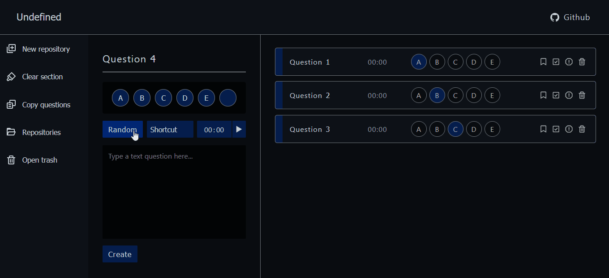

 

<h1 align="center">Question helper</h1>

Plataforma desenvolvida para salver o gabarito de provas e atividades durante o EAD. Tem como objetivo suprir as dificuldades das provas online, visto que, muitos plataformas não salvam os dados, dessa forma, em uma possível queda de energia ou eventual problema que exija um recarregamento da pagina, todos as respostas são perdidas. Ademias, a plataforma permite salvar os gabaritos em repósitórios, permitindo a arquivação dos dados de forma mais organizada.

 <a href="#motivacao">Motivação</a> |
 <a href="#solucoes">Suluções</a> |
 <a href="#compatibilidade">Compatibilidade</a> |
 <a href="#estrutura">Estrutura</a>

<h4 align="center"> 
	🚧  Under construction...  🚧
</h4>

## Motivação

Durante o EAD, a minha escola contratou uma plataforma para as aulas, contudo, as avaliações apresentavam muitos problemas. Dentre eles destaca-se o elevado tempo de carregamento, não apresentava salvamento automatico, perda de conexão com o servidor e modo offline indisponível.

Como em muitos casos eu perdia inumeras questões, normalmente eu marcava as questões em um papel, contudo, com o decorrer da pandemia, decidi desenvolver esta plataforma que não tivesse esses problemas para marcar as questões.

### Suluções

Como a plataforma deveria funcionar offline, optei por utilizar a indexedDB, uma API para armazenamento client-side de quantidades significantes de informações e buscas com alta performance por índices.

Com o objetivo de aumentar a performace, cada novo elemento é renderizado pelo react e adcionado ao DOM separadamente por meio do react render, ademais, em muitos cados, utilizo diretamente o DOM para ter acesso e alterar o valor de componentes distantes.

Para salvar os inputs, utilizo o localStorage, fazendo uma requisição no init do useState.

### Compatibilidade

A plataforma foi desenvolvide no FireFox, dessa forma, pode apresentar bugs e problemas em outros navegadores, esprecialmente no css. Apenas o Internet Explorer não apresenta compatibilidade com o indexedDB, impossibilitando o uso.

Ainda não desenvolvi o layout de outros tamanhos de monitor e mobile.

## Estrutura

- Components: componentes renderisados pelo react
- Data base: inicia e conecta com a IndexedDB
- Storage: funções que conectam o DOM com a database
